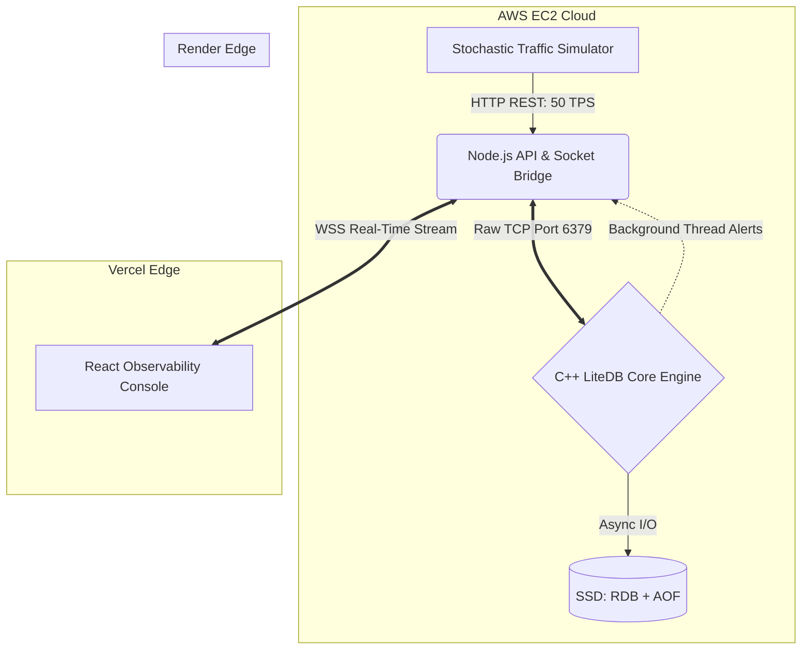

  
# LiteDB: Enterprise Fraud Detection Engine
**A High-Performance, Multi-Model In-Memory Database written in C++17**

> **LiteDB** is a bespoke, multi-threaded C++ storage engine built from first principles to process global credit card transactions at sub-millisecond latencies. By completely bypassing traditional relational database overhead, it executes geospatial trigonometry, bipartite graph clustering, and asynchronous disk persistence in **under 50 microseconds**, detecting money-laundering syndicates and impossible-velocity attacks in real-time.

---

## Cloud Architecture Topology

The ecosystem is decoupled into a 3-tier distributed architecture, communicating via raw TCP and WebSockets to ensure zero-polling latency.

---

## Core Systems Engineering

### 1. Dual-Persistence Storage (Beating the Disk Bottleneck)
To achieve DBMS Durability (ACID) without blocking the main event loop, LiteDB implements a highly optimized hybrid persistence model:
*   **Double-Buffered Write-Ahead Logging (WAL):** Live transactions are pushed to a RAM buffer in `<1µs`. A background flusher thread locks a discrete mutex, swaps the memory pointers via `std::swap` (taking **~10 nanoseconds**), and writes the batch to `litedb.aof` on the SSD in parallel.
*   **Asynchronous RDB Snapshotting:** Every 30 seconds, a detached `std::thread` serializes the entire RAM state (LRU, Bloom Filter bits, and blacklists) into a compressed binary `litedb.rdb` file. The massive AOF log is then truncated, enabling instantaneous crash-recovery on reboot.

### 2. Concurrency & Lock Optimization
*   **Shared-Mutex Read/Write Locks:** Memory is protected by C++17 `std::shared_mutex`. Infinite parallel read threads (`std::shared_lock`) can query the database concurrently without contention, while exclusive write locks (`std::unique_lock`) are reserved strictly for RAM mutations.
*   **Dual-Socket TCP Gateway:** The Node.js orchestrator splits traffic into two physical TCP sockets (`Swipe` and `Query`). This segregates high-volume transactional payloads from heavy UI analytical queries, preventing TCP packet-fragmentation deadlocks during high-concurrency bursts.

---

## Mathematical Threat Heuristics

### Layer 1: The Fast Path (Bloom Filters)
Implements an ultra-low memory bit-array using **FNV-1a** and **DJB2** non-cryptographic hashing (utilizing the *Kirsch-Mitzenmacher* optimization). Blacklisted merchants are verified in $O(1)$ nanoseconds.

### Layer 2: The Velocity Engine (Geospatial LRU)
Utilizes a `std::unordered_map` coupled with a `std::deque` to maintain a sliding window of global user coordinates.
*   **The Math:** Implements **Haversine spherical trigonometry** to calculate the Great-Circle distance between consecutive global swipes. 
*   **The Guard Clause:** If required travel speed exceeds commercial flight capabilities (>1000 km/h), the thread executes an early-return, freezing the card in $O(1)$ time and discarding the hacker's coordinates to protect the cache purity.

### Layer 3: The Syndicate Engine (Bipartite Graph Clustering)
An asynchronous background thread analyzes the `merchant <-> user` Bipartite Graph to catch money-laundering shell companies.
*   **Bayesian Ratio Protection:** To protect high-volume legitimate merchants (e.g., Amazon) from being blacklisted due to competitor sabotage, the AI calculates a dynamic Fraud Density Ratio `(compromised_users / total_users)`. Merchants are only auto-blacklisted if their hacker concentration exceeds 30% with a minimum sample threshold.
*   **Coarse-Grained TTL Eviction:** Inactive merchant nodes are safely flushed from RAM to a cold-storage `litedb_archive.log` on the SSD to prevent infinite memory leaks.

---

## Live Observability Dashboard
The React frontend serves as a premium, hardware-accelerated "War Room" console.
*   **Scale-Invariant GPU Mapping:** Utilizes `vectorEffect="non-scaling-stroke"` to offload global map zooming to the GPU, allowing 200x scroll-wheel panning at 60 FPS. Draws dynamic, geodesic laser arcs to visualize velocity fraud.
*   **C++ Micro-Profiling Telemetry:** The UI parses custom byte-strings from C++ to render live `Recharts` gauges, visually breaking down Mutex Lock acquisition (`T_LOCK`), Hash evaluation (`T_BLOOM`), and Math execution (`T_VELOCITY`) in real-time microseconds.
*   **State Deduplication:** Employs strict sequence-ticket hashing to maintain a flawless Round-Robin color paradigm across high-frequency WebSocket streams, immune to React StrictMode ghost-renders.
